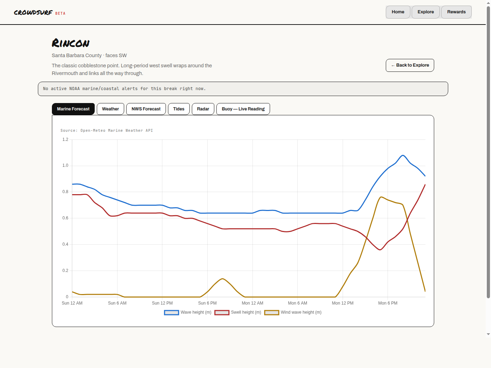
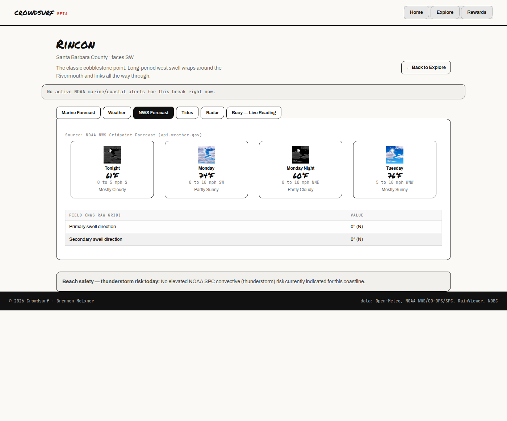
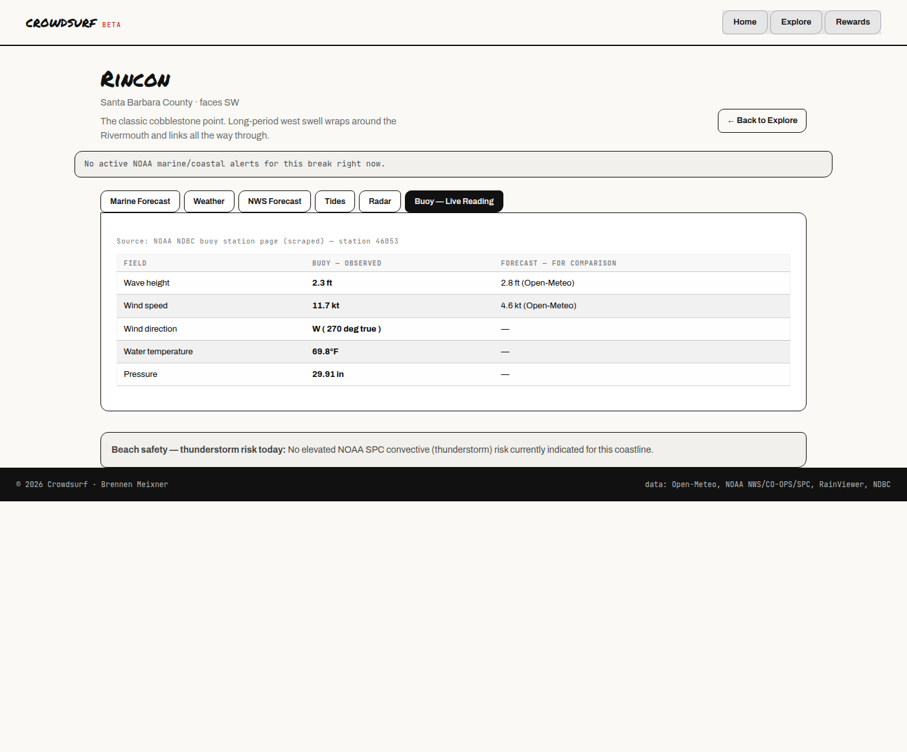
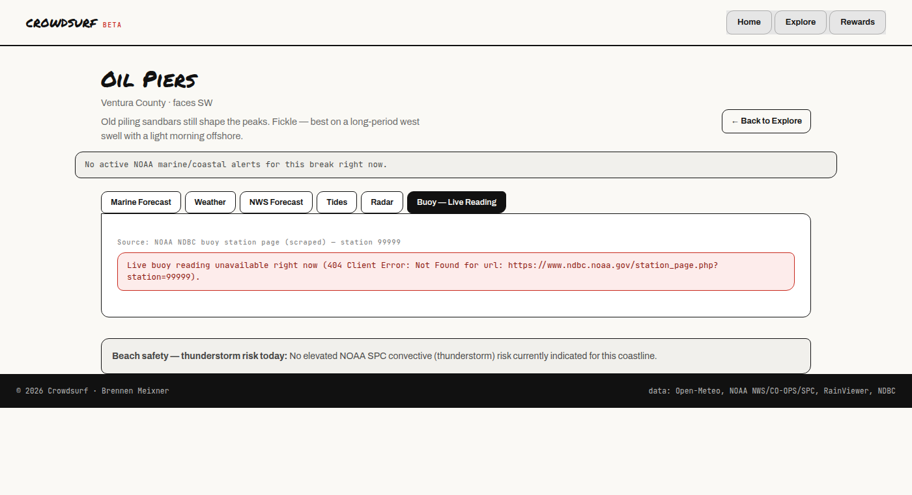

# Crowdsurf

IT401 Web Intelligence — Assignment 2 (A2)
Built by Brennen Meixner. Started from the `bpthoms/it401_project_template`
Flask template; A1 built the homepage/Explore filter on static sample data;
A2 replaces that static data with live external sources.

## Project Overview

Crowdsurf is a crowd-verified surf forecasting app. A1 shipped a homepage,
a shared layout, and an `/explore` page that filtered a static local JSON
file of sample surf breaks. A2 turns that into a real per-break forecast
dashboard: choosing a break now drives live requests to five external
APIs and one scraped webpage, assembled into one page that shows a
numeric forecast, an NWS alert banner, a tide chart, a radar/wind map, and
a real observed buoy reading compared side-by-side against the forecast —
the first working piece of Crowdsurf's "reconcile forecast vs. reality"
concept, ahead of the crowdsourced eyewitness-report side planned for a
later module.

## External Information Sources

| Source | Endpoint(s) used | Purpose | Auth |
|---|---|---|---|
| Open-Meteo Marine Weather API | `marine-api.open-meteo.com/v1/marine` | Hourly swell/wave/wind-wave height, direction, period, sea surface temp | none |
| Open-Meteo Weather Forecast API | `api.open-meteo.com/v1/forecast` | Hourly temperature, wind speed/gusts, precipitation, cloud cover, UV | none |
| NOAA NWS API | `api.weather.gov/gridpoints/{office}/{x},{y}` and `/forecast`, `/alerts/active` | Human-readable forecast periods, raw marine wave/swell fields, active High Surf/Small Craft/Coastal Flood/Rip Current alerts | none (descriptive `User-Agent` required) |
| NOAA CO-OPS Tides & Currents API | `api.tidesandcurrents.noaa.gov/api/prod/datagetter` | Tide predictions (high/low), a tide curve for charting, observed water temperature | none |
| NOAA SPC Day-1 Convective Outlook | `mesonet.agron.iastate.edu/json/spcoutlook.py` (Iowa State Mesonet point-query proxy for NOAA SPC's published outlook) | Beach/lightning-safety panel: thunderstorm risk category near the break | none |
| RainViewer Weather Maps API | `api.rainviewer.com/public/weather-maps.json` + tile server | Precipitation radar tile imagery — the "visual data" source, pinned to the break with a marker | none (requires visible attribution, included in the UI) |
| **Scraped:** NOAA NDBC buoy station page | `ndbc.noaa.gov/station_page.php?station=<id>` | Real, currently-observed buoy reading (wave height, dominant period, wind, water temp, pressure), shown next to the forecast for the same fields | n/a (public HTML page, no API) |
| Windy.com embed (bonus, not a backend call) | `embed.windy.com/embed2.html` | Interactive wind map centered on the break, client-side iframe only | none |

## Application Workflow

```
/explore (filter breaks, static local data)
        |
        v
  "View details" -> /break/<id>
        |
        v
  routes/main.py: load_breaks() + find_break()
        |
        v
  services/forecast_service.build_break_panel()
        |
        +--> services/openmeteo_service   (2 API calls)
        +--> services/nws_service         (2 API calls)
        +--> services/coops_service       (3 API calls)
        +--> services/spc_service         (1 API call)
        +--> services/radar_service       (1 API call)
        +--> services/buoy_scraper_service (1 scrape)
        |
        v
  every result: {live, source, data, fetched_at, error}
        |
        v
  templates/break_detail.html
  -- one tab per source, each checks its own `.live` flag
  -- a source being down never breaks the other panels
```

Each break's id in the URL is the one user-provided parameter that drives
every external request — a different break means different coordinates,
a different NWS gridpoint, and a different buoy/tide station.

## Information Model

**Local, student-curated reference data** (`data/breaks.json`, unchanged by
any live call):

- **Break** — `id`, `name`, `location`, `region`, `orientation`, `factors`
  (all from A1), plus new A2 fields: `latitude`, `longitude`, `nws_office`,
  `nws_grid_x`, `nws_grid_y`, `ndbc_station`, `coops_station`. These are a
  one-time-curated lookup table (confirmed per break against each real
  API/station), not something the app looks up dynamically.
- **Forecast reading** *(A1 sample values, still shown on `/explore`
  cards)* — `swell_ft`, `period_s`, `tide_ft`, `wind`, nested on Break.

**Externally acquired data** (fetched live per request in
`services/forecast_service.py`, never persisted to `breaks.json` or any
database):

- Marine/weather hourly series (Open-Meteo)
- NWS forecast periods + raw wave fields, active alerts (NWS)
- Tide predictions, tide curve, water temperature (CO-OPS)
- Convective outlook category (SPC)
- Radar tile URLs (RainViewer)
- Observed buoy reading (NDBC, scraped)

**Survey report** *(planned, not built)* — `break_id`, `timestamp`,
user-submitted wave size, quality, wind, crowd level — still a later
module, per the build order below.

## Project Structure

```
IT401WebIntelligence/
|-- app.py                          # create_app() factory; loads .env before config
|-- config.py                       # settings + env-based config (no hardcoded secrets)
|-- requirements.txt
|-- .env.example                    # documents required env vars, no real values
|-- routes/
|   `-- main.py                     # /, /explore, /rewards, /break/<id> -- thin
|-- services/
|   |-- breaks_service.py            # load_breaks(), filter_breaks(), find_break()
|   |-- forecast_service.py          # orchestrator: fans out to every source below
|   |-- openmeteo_service.py         # Open-Meteo Marine + Weather APIs
|   |-- nws_service.py               # NOAA NWS gridpoint forecast + active alerts
|   |-- coops_service.py             # NOAA CO-OPS tides + water temperature
|   |-- spc_service.py               # NOAA SPC convective outlook (via Mesonet proxy)
|   |-- radar_service.py             # RainViewer radar tiles + tile-math helpers
|   |-- buoy_scraper_service.py      # NOAA NDBC station-page scrape (BeautifulSoup)
|   |-- external_common.py           # shared {live, source, data, error} result shape
|   |-- rewards_service.py           # unrelated A1 rewards-page logic
|   |-- search_service.py            # unused stub, out of scope
|   `-- ai_service.py                # unused stub, out of scope
|-- models/
|-- templates/
|   |-- base.html                    # Foundation CDN + shared nav/footer
|   |-- index.html / explore.html / rewards.html
|   `-- break_detail.html            # new per-break dashboard (Tabs + Chart.js)
|-- static/
|   |-- style.css                    # brand overrides layered on top of Foundation
|   `-- crowdsurflogo.png
|-- data/
|   `-- breaks.json                  # local reference data + new lat/lon/station fields
|-- docs/
|   `-- screenshots/
`-- tests/
    |-- test_app.py                  # route + find_break tests
    |-- test_<source>_service.py     # one per external service, mocked requests
    |-- test_forecast_service.py     # orchestrator: all-succeed/all-fail/partial-fail
    |-- fake_response.py             # shared mock for requests.get()
    `-- fixtures/                    # saved NDBC HTML for network-free scraper tests
```

## Environment Variables

See `.env.example` (copy it to `.env`, which is gitignored and never
committed):

| Variable | Required? | Purpose |
|---|---|---|
| `FLASK_ENV` | no (defaults to `development`) | selects `config.py`'s config class |
| `SECRET_KEY` | no (defaults to `dev`) | Flask session secret |
| `NWS_USER_AGENT` | recommended | descriptive contact string NWS's API policy asks for in every request header |
| `EXTERNAL_API_TIMEOUT` | no (defaults to `10`) | seconds before any external call times out |
| `API_KEY`, `AI_SERVICE_API_KEY` | no | reserved, unused — every A2 source is free and keyless (see Known Limitations) |

No A2 data source actually requires a secret. `config.py` still reads
`API_KEY`/`AI_SERVICE_API_KEY` from the environment (never hardcoded) so
that scaffolding is ready the moment a keyed source is added.

## Installation Instructions

**Prerequisites:** Python 3.10+, Git.

1. Clone the repository and change into it:

   ```bash
   git clone <repository-url>
   cd IT401WebIntelligence
   ```

2. Create and activate a virtual environment:

   ```bash
   python3 -m venv .venv
   source .venv/bin/activate        # macOS/Linux
   .venv\Scripts\activate           # Windows
   ```

3. Install dependencies:

   ```bash
   pip install -r requirements.txt
   ```

4. Configure environment variables:

   ```bash
   cp .env.example .env
   # edit .env and fill in NWS_USER_AGENT with your own contact info
   ```

5. Run the app:

   ```bash
   python app.py
   ```

   Served at [http://127.0.0.1:5000](http://127.0.0.1:5000). The homepage
   and `/explore` work with no internet connection (local JSON only); the
   new `/break/<id>` dashboard needs internet access to reach the six
   external sources, and degrades gracefully (per-panel fallback
   messages) if any of them is unreachable.

6. Run the tests:

   ```bash
   python -m pytest tests/
   ```

   41 tests: one status-code test per route, service-level unit tests for
   every external source (mocked `requests` calls, no network needed),
   fixture-based scraper tests, and orchestrator tests covering
   all-sources-succeed / all-sources-fail / one-source-fails scenarios.

## Current Features

Mapped to the five capability areas this milestone adds:

- **API integration** — 5 keyless REST APIs called live per break (Open-Meteo
  Marine + Weather, NOAA NWS forecast + alerts, NOAA CO-OPS tides/water temp,
  NOAA SPC outlook, RainViewer radar); see `services/forecast_service.py`.
- **Web scraping** — a NOAA NDBC buoy station page scraped with
  BeautifulSoup for a real observed reading; see
  `services/buoy_scraper_service.py`.
- **Data cleaning** — NWS's raw SI units/camelCase field names are
  converted to labeled, feet/compass-formatted values; a literal `0`
  placeholder NWS reports for ungridded wave fields is filtered out
  instead of shown as a fake "flat" reading (see Error Handling); scraped
  buoy text is parsed to numbers, not shown as raw HTML.
- **User search/filtering** — the A1 `/explore` filters (name/region/wind)
  over local sample data, plus choosing a break (the URL parameter) as
  the live input that shapes every external request on its detail page.
- **Error handling** — every source degrades to a per-panel fallback
  message instead of crashing the page; see the full Error Handling
  section below.

Page by page:

- **Homepage** (`/`) — unchanged concept from A1, copy updated to reflect
  live data.
- **`/explore`** — the A1 filter (name/region/wind) over the local sample
  dataset, now restyled on Foundation, each card linking to its live
  break detail page.
- **`/break/<id>`** *(new)* — a per-break dashboard with six tabs:
  - **Marine Forecast** — Chart.js line chart of wave/swell/wind-wave
    height (Open-Meteo).
  - **Weather** — temperature/wind/gust chart (Open-Meteo).
  - **NWS Forecast** — human-readable forecast period cards + a raw
    marine wave/swell data table, human-labeled and unit-converted.
  - **Tides** — a tide-height curve chart plus a high/low table and
    observed water temperature (CO-OPS).
  - **Radar** — a RainViewer precipitation radar tile pinned to the break
    with an exact-position marker, plus a Windy.com interactive wind map.
  - **Buoy — Live Reading** — the core data-integration feature: a real,
    currently-observed buoy reading (scraped from NDBC) shown next to the
    matching forecast numbers for the same break.
  - An NWS active-alerts banner sits above the tabs; a NOAA SPC
    thunderstorm-risk note sits below them.
- **`/rewards`** — unchanged from A1 (membership/rewards concept sketch,
  restyled only).
- **Data cleaning** — NWS's raw SI units/camelCase field names are
  converted to labeled, feet/compass-formatted values; a literal `0`
  placeholder NWS reports for ungridded wave fields is filtered out
  instead of shown as a fake "flat" reading (see Error Handling).
- **User-driven filtering + selection** — the A1 `/explore` filters, plus
  choosing a break (the URL parameter) as the input that shapes every
  external request on the detail page.

## Error Handling

Every external call (API or scrape) goes through the same contract:
each service function returns
`{live, source, data, fetched_at, error}` and never raises — failures are
caught internally and turned into `live: False` with a human-readable
`error` string. `services/forecast_service.build_break_panel()` wraps
every one of those calls in a second, outer try/except as a last-resort
guard, so a genuinely unexpected exception in one source still can't take
down the page.

- **Missing API key** — n/a for A2's sources (all keyless); the one
  quasi-credential, `NWS_USER_AGENT`, falls back to a generic default
  string in `config.py` if unset, so the app still boots without a `.env`.
- **API errors / network failure / rate limits** — caught per source;
  the matching tab shows a small red "Live data unavailable right now
  (&lt;reason&gt;)" callout instead of crashing. Verified live: see
  `docs/screenshots/break-detail-fallback.png`, captured by temporarily
  pointing one break at an invalid NDBC station id.
- **Invalid user input** — an unknown `break_id` in the URL returns a real
  HTTP 404 with a "Break not found" page, not a 500 or a blank page
  (`tests/test_app.py::test_break_detail_unknown_id`).
- **Empty results** — an empty NWS alerts list renders as "No active
  NOAA marine/coastal alerts" instead of nothing; a CO-OPS station with
  no water-temperature sensor (confirmed live: Santa Barbara station
  9411340 has none) shows "not published for this station" instead of a
  blank field or a crash.
- **Changed/missing HTML elements** — the NDBC scraper matches fields by
  label text independently (no single required selector), so a missing
  or renamed field just omits that one value; a page with zero matching
  fields still returns `live: True` with an empty reading rather than
  failing (`tests/test_buoy_scraper_service.py`).
- **Data quality** — NWS's raw gridpoint data reports a literal `0` for
  wave height/period on nearshore grid points it doesn't actually
  forecast (confirmed live against Rincon's real LOX gridpoint); that
  placeholder is filtered out rather than shown as a real "flat" reading.

## Ethical Considerations

- **Data attribution** — every tab on `/break/<id>` names its source
  (Open-Meteo, NOAA NWS/CO-OPS/SPC, RainViewer, NDBC); RainViewer's free
  terms require a visible "Weather data by RainViewer" credit, included
  directly under the radar imagery.
- **Public-domain data** — NOAA (NWS, CO-OPS, SPC, NDBC) publishes are US
  government works and public domain; this is the lowest-risk category of
  external data to depend on.
- **Scraping the NDBC page responsibly** — `ndbc.noaa.gov/robots.txt` was
  checked before writing the scraper (2026-09-20): it disallows only
  specific bots (`008`, `SemrushBot`, `SemrushBot-SA`), not the
  `station_page.php` path in general. The scraper sends a descriptive
  `User-Agent`, fetches one page per request (no crawling/looping), and
  requests nothing beyond the single station page needed.
- **Honest `User-Agent`** — NWS's API usage policy asks for a descriptive
  contact string on every request; `NWS_USER_AGENT` is configurable via
  `.env` rather than a generic/spoofed value.
- **No PII** — A2 collects no user data at all (no survey feature yet);
  nothing here changes that.
- **Rate limits / not hammering sources** — no source is polled in a
  loop; every value is fetched once per page load with a bounded timeout
  (`EXTERNAL_API_TIMEOUT`), and known gap: there's no caching yet, so
  heavy traffic would re-fetch every source on every request (see Known
  Limitations).
- **Honesty about what actually works** — the Radar tab documents, in the
  UI itself, that Windy's public embed doesn't support switching to a
  swell/sea-temp/satellite layer (verified through live testing, not
  assumed) rather than shipping a control that looks functional but
  isn't.

## Known Limitations

- Per-break `nws_office`/`nws_grid_x`/`nws_grid_y`/`ndbc_station`/
  `coops_station` are a static, manually curated lookup table (confirmed
  against real API responses during development), not a dynamic
  nearest-station lookup.
- RainViewer's radar tiles only render real imagery up to zoom 7
  (confirmed by probing their tile server directly); finer zooms return a
  fixed placeholder image, so the radar tile itself stays regional — a
  marker pin, not tighter zoom, is what actually localizes it to the
  break.
- Windy's public embed only reliably shows its default wind layer from a
  plain URL; its documented `overlay=` parameter for swell/waves didn't
  switch layers in testing, and it has no sea-surface-temperature or
  satellite layer at all. Swell height and sea temperature are already
  covered by the Marine Forecast and Tides tabs' real numeric data
  instead.
- SPC data is delivered through a third-party academic proxy (Iowa State
  Mesonet), not a NOAA-operated endpoint directly — the underlying data
  is still NOAA SPC's, but availability depends on that mirror staying up.
- The NDBC scraper matches on label text (the page has no id/class
  hooks), which is more fragile to a future NOAA page redesign than an
  id-based selector would be.
- No caching or persistence — every `/break/<id>` load re-fetches all six
  sources live; a busy page could approach a source's informal rate
  limits. SQLite-backed caching is planned for a later module.
- No survey/reconciliation/AI features yet — still out of scope until
  their respective modules (see Future Work).

## Screenshots

**Homepage**


**Explore — unfiltered**


**Explore — filtered ("rincon")**


**Break detail — Marine Forecast (API results)**



**Break detail — NWS Forecast tab**



**Break detail — Buoy Live Reading (scraped data + combined interface)**



**Break detail — a source deliberately taken offline (error handling)**



## Future Work

- **A3 (persistence):** SQLite-backed storage; cache external-source
  responses instead of re-fetching live on every request; a dynamic
  nearest-station lookup instead of the static table.
- **Later modules:** the survey submission form and storage for the
  crowdsourced Survey report entity, reconciliation logic blending live
  data with survey reports into one per-break forecast, and an LLM agent
  summary of the reconciled result.
