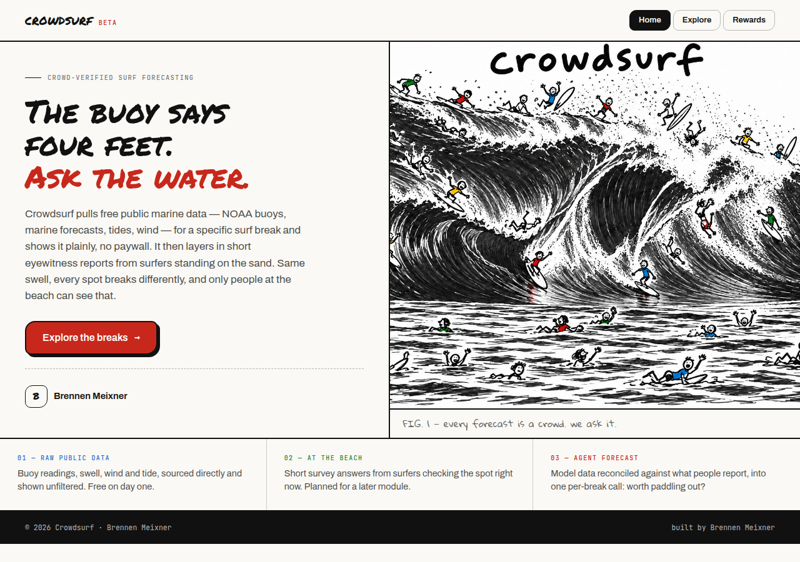
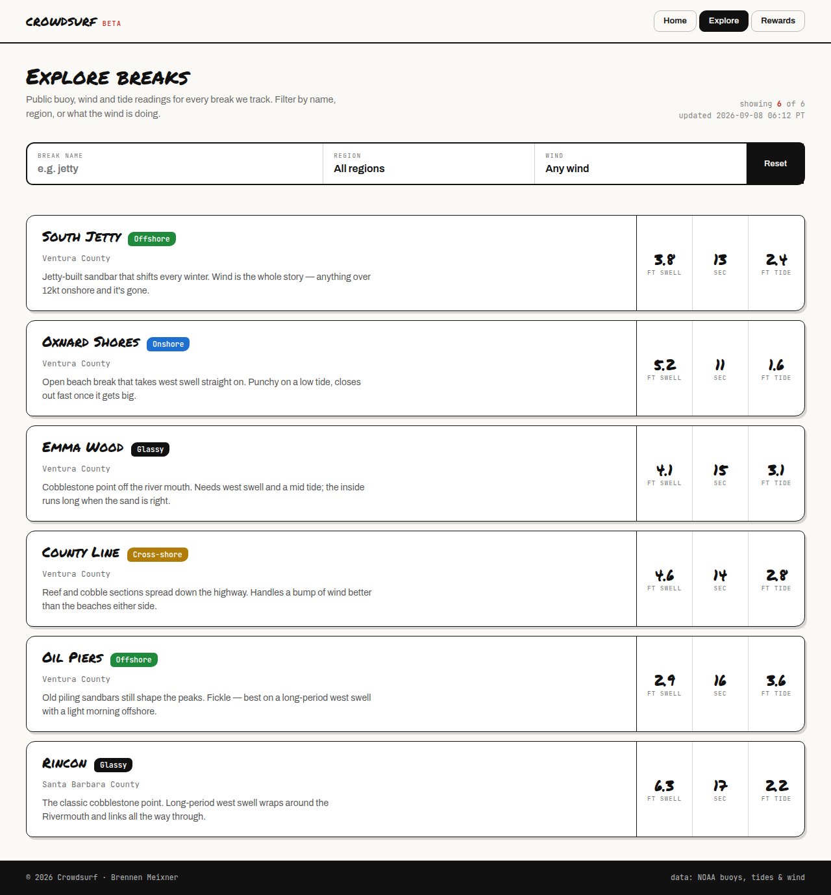
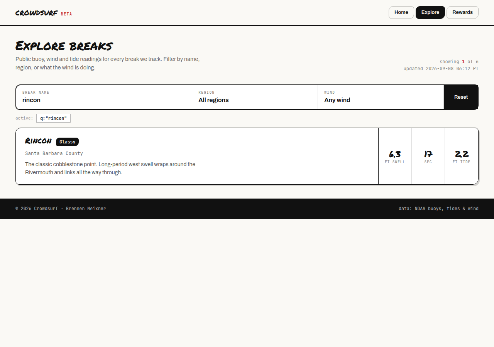

# Crowdsurf

IT401 Web Intelligence — Assignment 1 (A1)
Built by Brennen Meixner from the `bpthoms/it401_project_template` Flask template.

## Project Overview

Crowdsurf is a crowd-verified surf forecasting app: it will eventually pull
public marine/weather data (NOAA buoys, marine forecasts, tides, wind) for a
surf break and reconcile it against short eyewitness reports filed by
surfers standing on the sand. This A1 milestone customizes the project
template with a real homepage, a shared page layout, and an `/explore` page
that lists sample surf breaks and lets a visitor filter them live by name,
region, and wind condition — all against a static local JSON file, with no
live API calls yet.

## Preliminary Semester Project Concept

Same swell, different break — every surf spot reacts differently to the
same incoming conditions, and only someone standing at the beach can see
that. Crowdsurf's idea is to combine two data sources per break:

1. **Raw public data** — buoy readings, marine forecasts, tides, and wind,
   pulled directly from NOAA/NWS/Open-Meteo (Module 2+, not built yet).
2. **Eyewitness reports** — a short survey surfers fill out from the beach:
   wave size, quality, wind, crowd (later module).

Later in the semester these two sources get reconciled into a single
per-break forecast, with the option to view the raw data, the reconciled
forecast, or the raw "what people are saying" reports on their own.

Build order (so later work doesn't get scaffolded ahead of the current
module):

1. **A1 (this milestone):** homepage, `base.html`, `/explore`, a static
   JSON sample dataset, and a live filter.
2. **Module 2+:** replace the static JSON with real API calls, wrapped in
   try/except with a fallback so the page still renders if a service is
   down.
3. **Later modules:** SQLite persistence, survey submission + storage,
   reconciliation logic, then an LLM agent summary.

## Current Features

- **Homepage** (`templates/index.html`) — the Crowdsurf name and tagline,
  a short description of the concept, a hero illustration, the student
  byline, and a call-to-action button linking to `/explore`.
- **Shared layout** (`templates/base.html`) — page title, header/nav
  (Home / Explore), a stylesheet link, and footer. Every page
  `` — no duplicated head/nav/footer markup.
- **`/explore`** (`templates/explore.html`) — lists the sample surf breaks
  from `data/breaks.json` and supports a live, user-driven filter over
  three query params: break name (substring match), region, and wind
  condition. A filter that matches nothing renders a "Flat. Nothing here."
  empty state instead of an error.

> Note: the app also has a `/rewards` page prototyped from the same design
> session — it's a membership/rewards concept sketch, not part of the A1
> requirements, and isn't reconciliation/survey/agent functionality.

## Information Model (Conceptual)

Three core entities drive the project, per the semester concept above.
Only **Break** and a sample **Forecast reading** are implemented in A1
(as `data/breaks.json`); **Survey report** is planned for a later module.

- **Break** — `id`, `name`, `location` / `region`, `orientation`, a few
  known local factors (`factors`).
- **Forecast reading** *(implemented as a nested sample value on Break
  for A1; will become its own record with a `break_id` and `timestamp`
  once it's backed by a live API)* — `swell_ft`, `period_s`, `tide_ft`,
  `wind`.
- **Survey report** *(planned, not built)* — `break_id`, `timestamp`,
  user-submitted wave size, quality, wind, and crowd level.

## Project Structure

```
IT401WebIntelligence/
|-- app.py                     # create_app() factory, entry point
|-- config.py                  # settings + env-based config
|-- requirements.txt
|-- routes/
|   `-- main.py                 # /, /explore (thin -- parses request, calls a service, renders)
|-- services/
|   |-- breaks_service.py        # load_breaks() + filter_breaks() over data/breaks.json
|   |-- search_service.py        # unused stub, out of scope for A1
|   |-- api_service.py           # generic outbound HTTP client, unused until Module 2+
|   `-- ai_service.py            # unused stub, out of scope for A1
|-- models/
|-- templates/
|   |-- base.html                # shared title/nav/footer, all pages extend this
|   |-- index.html               # homepage
|   `-- explore.html             # break list + filter form
|-- static/
|   |-- style.css
|   `-- crowdsurflogo.png
|-- data/
|   `-- breaks.json              # sample break/forecast data (static, no live API)
|-- docs/
|   `-- screenshots/              # README screenshots
`-- tests/
    `-- test_app.py
```

## Installation Instructions

**Prerequisites:** Python 3.10+, Git.

1. Clone the repository and change into it:

   ```bash
   git clone <repository-url>
   cd IT401WebIntelligence
   ```

2. Create and activate a virtual environment:

   ```bash
   python3 -m venv .venv

   # macOS / Linux
   source .venv/bin/activate

   # Windows (Command Prompt / PowerShell)
   .venv\Scripts\activate
   ```

3. Install dependencies:

   ```bash
   pip install -r requirements.txt
   ```

4. Run the app:

   ```bash
   python app.py
   ```

   The app is served at [http://127.0.0.1:5000](http://127.0.0.1:5000).
   No API keys are required for A1 — all data comes from `data/breaks.json`.

5. Run the tests:

   ```bash
   python -m pytest tests/
   ```

## Screenshots

**Homepage**



**Explore — unfiltered**



**Explore — filtered ("rincon")**



## Future Work

- **Module 2:** swap `data/breaks.json` for real calls to NOAA NDBC
  buoys, NOAA/NWS marine forecasts, NOAA CO-OPS tides, and Open-Meteo
  wind, made from `services/`, each wrapped in try/except with a
  `*_live = True/False`-style fallback flag so the page still renders if
  an external service is down.
- **Later modules:** SQLite persistence, a survey submission form and
  storage for the crowdsourced Survey report entity, reconciliation logic
  that blends live data with survey reports into one per-break forecast,
  and an LLM agent summary of the reconciled forecast.
